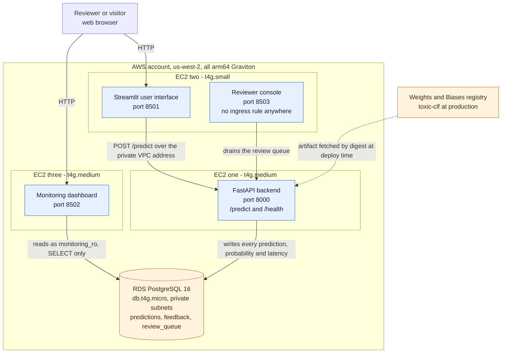
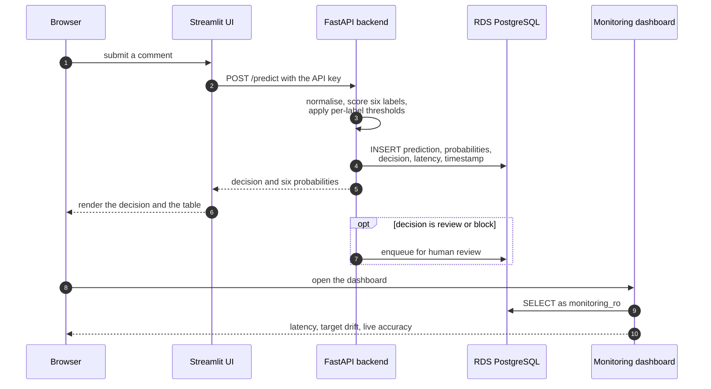
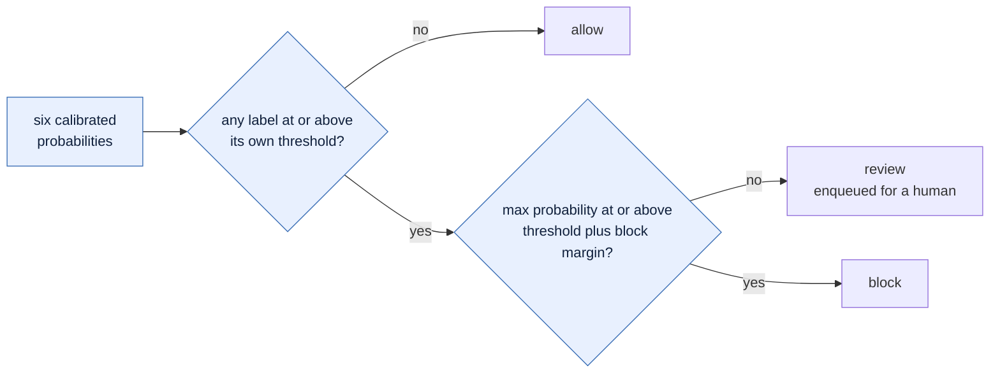
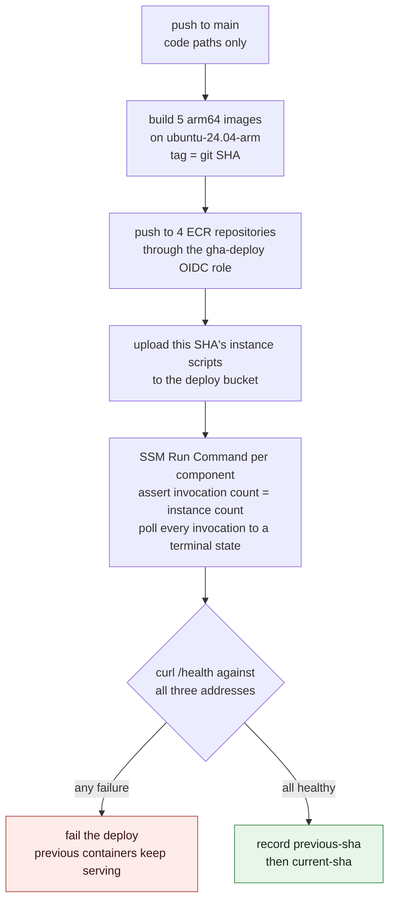

# mlops-toxic-moderation

A multi-label toxic comment moderation service, built and operated end to end: experiment
tracking and a model registry, a FastAPI backend, a managed Postgres database, a user
interface, a monitoring dashboard on its own server, and a CI gate that blocks merges.

Six labels, scored independently: `toxic`, `severe_toxic`, `obscene`, `threat`, `insult`,
`identity_hate`. Trained on the Jigsaw English toxic-comment corpus.

## Open the running system

All three services are deployed on separate EC2 instances and are answering now. Click any
of them. Nothing needs to be installed, and no credential is required.

| Open this | What it is |
|---|---|
| **<http://34.210.186.130:8501>** | **Start here.** Type a comment, get the moderation decision and all six calibrated probabilities |
| **<http://52.43.232.239:8502>** | Monitoring dashboard: prediction latency over time, predicted-class distribution against the training baseline, live accuracy from human review |
| **<http://44.239.182.162:8000/health>** | Backend readiness, model version, and database status, as JSON |

Two more surfaces, both public and both rendering without an account:

- Experiment tracking, nine runs with git SHA, hyperparameters and metrics:
  <https://wandb.ai/rockcyber/mlops-toxic-moderation/reports/Toxic-comment-moderation---experiment-tracking--VmlldzoxNzY5OTgyOQ==>
- Model registry with the promoted `production` stage:
  <https://wandb.ai/rockcyber/mlops-toxic-moderation/artifacts/model/toxic-clf/v1>

## Architecture



The dashboard never calls the backend. It reads the database directly under a role that
holds `SELECT` and nothing else, so the component being graded on the data cannot alter it.

The reviewer console on 8503 has no ingress rule on any security group. It is reached
through an SSM port-forward session. [`infra/exposure.py`](infra/exposure.py) is the single
source of truth for which port is public, and a test holds the Terraform to it.

## For the instructor

Every requirement, and the fastest way to confirm it.

| Requirement | Confirm it here |
|---|---|
| **1. Experiment tracking and model registry** | The [W&B report](https://wandb.ai/rockcyber/mlops-toxic-moderation/reports/Toxic-comment-moderation---experiment-tracking--VmlldzoxNzY5OTgyOQ==) lists every run with its git SHA, hyperparameters, metrics and data version. The [registry](https://wandb.ai/rockcyber/mlops-toxic-moderation/artifacts/model/toxic-clf/v1) shows `toxic-clf` v1 carrying the `production` alias |
| **2. ML model backend, FastAPI** | <http://44.239.182.162:8000/health> answers with no credential. <http://44.239.182.162:8000/docs> is the OpenAPI schema. The `curl` examples below exercise `/predict` |
| **3. Persistent data store** | AWS RDS PostgreSQL. Every prediction, its six probabilities, its decision and its latency are written on the request path. The dashboard renders entirely from it |
| **4. Frontend interface** | <http://34.210.186.130:8501> — submit a comment, read the decision. It calls the backend over HTTP; it does not load the model itself |
| **5. Model monitoring dashboard** | <http://52.43.232.239:8502> — on its own EC2 instance, reading the database rather than any file exchange |
| **6. CI/CD pipeline** | [`.github/workflows/ci.yml`](.github/workflows/ci.yml) runs `ruff` and the full `pytest` suite on every pull request. [`docs/evidence/ci-gate.md`](docs/evidence/ci-gate.md) records a pull request being refused for failing checks, through the API and the CLI |
| Clause-by-clause self-grade | [`docs/rubric-conformance.md`](docs/rubric-conformance.md) maps each numbered clause to its evidence, including the one clause marked PARTIAL and why |
| Model documentation | [`MODEL_CARD.md`](MODEL_CARD.md) — metrics with confidence intervals, fairness slices across 54 identity groups, known limitations |

**The user interface needs no key.** It holds the demo API key server-side, so submitting a
comment in the browser exercises the full path with nothing to configure. The key is only
needed to call `/predict` directly with `curl`, and it travels with the assignment
submission rather than being published in this repository.

## What runs where

| Instance | Class | Component | Port | Reachable at |
|---|---|---|---|---|
| EC2 #1 | `t4g.medium` | FastAPI backend, `/predict` and `/health` | 8000 | <http://44.239.182.162:8000> |
| EC2 #2 | `t4g.small` | Streamlit user interface | 8501 | <http://34.210.186.130:8501> |
| EC2 #2 | `t4g.small` | Reviewer console | 8503 | operator only, over SSM |
| EC2 #3 | `t4g.medium` | Monitoring dashboard | 8502 | <http://52.43.232.239:8502> |
| RDS | `db.t4g.micro` | PostgreSQL 16, private subnets | 5432 | no internet path |

There is no SSH. Port 22 is closed on every security group, no key pair exists, and the
service control policy denies the calls that would create one. Remote work runs over AWS
Systems Manager, and [`docs/runbooks/no-ssh-debug.md`](docs/runbooks/no-ssh-debug.md) is the
recovery path when a host stops answering.

## How a prediction flows



## How the decision is made

Each label carries its own threshold, tuned on out-of-fold predictions rather than on the
test set. A probability at or above its threshold sets that label's flag.



Thresholds, the block margin, and the measured effect of each on the flag rate are in
[`MODEL_CARD.md`](MODEL_CARD.md).

## Example requests

`/health` needs no credential:

```bash
curl -sS "http://44.239.182.162:8000/health"
```

```json
{
  "status": "ok",
  "model_version": "toxic-clf:v1",
  "database": "ok",
  "spool_depth": 0,
  "rejected": {"unauthenticated": 0, "rate_limited": 0, "oversize": 0}
}
```

`status` is `ok` only when the database answers and the write spool is empty. The deploy gate
asserts it on all three instances. The response carries the opaque model version, never the
artifact digest.

`/predict` takes one comment and returns a calibrated probability and a flag for each of the
six labels, plus a moderation decision. Set `DEMO_API_KEY` to the key supplied with the
submission first. The responses below are real, captured from the running service.

**A comment that is allowed:**

```bash
curl -X POST "http://44.239.182.162:8000/predict" \
  -H "Content-Type: application/json" \
  -H "X-API-Key: $DEMO_API_KEY" \
  -d '{"text": "thanks for the thoughtful edit, this reads much better now"}'
```

```json
{
  "request_id": "ece05d59-d09c-4e3f-b4e5-adec031ad326",
  "model_version": "toxic-clf:v1",
  "labels": {
    "toxic":         {"prob": 0.0023, "flag": false},
    "severe_toxic":  {"prob": 0.0005, "flag": false},
    "obscene":       {"prob": 0.0012, "flag": false},
    "threat":        {"prob": 0.0002, "flag": false},
    "insult":        {"prob": 0.0027, "flag": false},
    "identity_hate": {"prob": 0.0003, "flag": false}
  },
  "decision": "allow",
  "max_prob": 0.0027,
  "latency_ms": 19
}
```

**A comment that is flagged and enqueued for human review:**

```bash
curl -X POST "http://44.239.182.162:8000/predict" \
  -H "Content-Type: application/json" \
  -H "X-API-Key: $DEMO_API_KEY" \
  -d '{"text": "you are an absolute clueless idiot and everyone knows it"}'
```

```json
{
  "request_id": "80da0ae0-82ec-49b4-ac8a-cdc74d421568",
  "model_version": "toxic-clf:v1",
  "labels": {
    "toxic":         {"prob": 0.9968, "flag": true},
    "severe_toxic":  {"prob": 0.0154, "flag": false},
    "obscene":       {"prob": 0.6744, "flag": true},
    "threat":        {"prob": 0.0018, "flag": false},
    "insult":        {"prob": 0.9881, "flag": true},
    "identity_hate": {"prob": 0.0113, "flag": false}
  },
  "decision": "review",
  "max_prob": 0.9968,
  "latency_ms": 20
}
```

Three labels flag, the decision is `review` rather than `block` because the margin above the
threshold is not wide enough, and the comment lands in the review queue. The dashboard's
queue counter moves after you try it.

**The refusals, so the error messages are not a surprise.** Requests with no key are refused
before the body is parsed. The input cap is `MAX_INPUT_CHARS`, 5000 characters, enforced by
the request schema. Bodies are separately capped at 16 KB, and each caller is limited to 30
requests per minute with a burst of 10. The limit is per caller rather than per API key, so
one visitor holding the button cannot rate limit the next one, and a looser ceiling on the
source address sits behind it.

```bash
# no key
curl -i -X POST "http://44.239.182.162:8000/predict" \
  -H "Content-Type: application/json" -d '{"text": "hello"}'
# HTTP/1.1 401 Unauthorized

# empty text
curl -i -X POST "http://44.239.182.162:8000/predict" \
  -H "Content-Type: application/json" \
  -H "X-API-Key: $DEMO_API_KEY" -d '{"text": ""}'
# HTTP/1.1 422 Unprocessable Entity
```

**Through the user interface instead.** Open <http://34.210.186.130:8501>, paste a comment,
press **Check comment**. The decision and the six per-label probabilities render, and an
agree/disagree control writes a feedback row that the dashboard's live-accuracy panel reads.

## Setup

Running locally is optional. The deployed system above is the artifact being assessed.

Local development needs Python 3.11, Docker with Compose v2, and `make`. Nothing here
touches AWS.

```bash
git clone https://github.com/rocklambros/mlops-toxic-moderation.git
cd mlops-toxic-moderation
make venv                       # 3.11 venv, hashed lock, --require-hashes
make lint test                  # ruff and the unit suite
```

Bring the whole stack up locally, including Postgres:

```bash
export DEMO_API_KEY="$(openssl rand -hex 16)"
export REVIEWER_SHARED_SECRET="$(openssl rand -hex 16)"
export SUBMITTER_FP_KEY="$(openssl rand -hex 16)"
docker compose -f infra/docker-compose.yml up -d --build
```

Generated rather than typed, and deliberately not printed here: a literal in a public README
is a credential somebody pastes into something that is not a laptop. Every credential is an
interpolated variable with no default, so a missing one fails the `up` rather than starting
the reviewer console on a secret nobody chose.

The user interface is then on <http://localhost:8501>, the dashboard on
<http://localhost:8502>, and the API on <http://localhost:8000>.

Local compose serves a small deterministic fixture rather than the trained artifact, so the
stack runs offline. Reproducing the trained model needs a Kaggle account for the Jigsaw
corpus and roughly two hours of fit time; [`MODEL_CARD.md`](MODEL_CARD.md) section 10 records
the exact commands, seeds and hardware. The data pipeline alone runs on a committed fixture:

```bash
make data                       # deterministic split and the leakage firewall gate
```

## Deployment

Deployment is a GitHub Actions workflow,
[`.github/workflows/deploy.yml`](.github/workflows/deploy.yml). There is no manual `docker`
step and no SSH.



The health gate is the real check. A build that pushes images but cannot answer `/health` on
all three addresses fails, and the containers already running keep serving.

Infrastructure is Terraform under [`infra/terraform/`](infra/terraform/): VPC, three EC2
instances, RDS, four ECR repositories, IAM roles, CloudTrail, GuardDuty, CloudWatch alarms
and the budget. Applying it is an operator action from an IAM Identity Center session, never
an unattended workflow. The CI deploy role is denied `ec2:RunInstances` and `rds:*`, so a
documentation commit cannot replace three instances.

```bash
gh workflow run deploy.yml --ref main   # build, push, roll, verify
make deploy-verify                      # re-run the health gate on its own
```

To return to the previously deployed SHA without touching Terraform:

```bash
make rollback SHA=$(aws ssm get-parameter --name /toxic/deploy/previous-sha \
  --query Parameter.Value --output text)
```

[`infra/ROLLBACK.md`](infra/ROLLBACK.md) is the full procedure. It has been rehearsed against
the running system and recorded in
[`docs/evidence/p5-rollback-rehearsal.md`](docs/evidence/p5-rollback-rehearsal.md).

## Monitoring

The dashboard shows three things: prediction latency over time as per-day p50 and p95,
predicted-class distribution against the pinned training baseline as a target-drift signal
with a PSI alert threshold, and live accuracy from human review.

Live accuracy is a Horvitz-Thompson estimate over two probability-sampled strata: every
flagged item is reviewed, and a `RANDOM_AUDIT_RATE` fraction of the rest is audited. The
inclusion probability is stored on each `review_queue` row at enqueue time, so the estimate
stays sound when the rate changes. User feedback from the agree/disagree control is collected
and displayed with its own interval but is deliberately **excluded** from that estimate: a
self-selected click has no known inclusion probability, and a graded metric must not be
writable by an anonymous visitor.

Most rows are a replay. `make seed-demo` sends roughly 2,000 comments from the locked
held-out split through the live `/predict` endpoint so the dashboard has a realistic history.
Those predictions and their latencies are real model outputs; only the timestamps are spread
across previous days. Every seeded row carries `predictions.is_seed = true`, and the
dashboard prints how many of the displayed rows came from the replay at the top of the page.

Seeding the deployed stack is an operator procedure with two wrinkles worth knowing, both
documented in [`docs/evidence/p5-deploy-traversal.md`](docs/evidence/p5-deploy-traversal.md):
RDS is private so the seeder reaches it through an SSM port-forward, and replaying 2,000
comments from one address trips the per-caller rate limit, which is raised for the window and
restored afterwards. That restore is a visible operator action rather than a retry loop
inside the seeder, because an abuse control a tool quietly works around is not a control.

## Data handling and retention

`/predict` stores the submitted comment in `predictions.input_text`. A scheduled purge nulls
it after `INPUT_TEXT_RETENTION_DAYS`, default 30, and keeps the rest of the row for
monitoring. Raw comment text is never written to Weights & Biases, to application logs, or to
any screenshot in this repository. The review queue keeps its own snapshot so a purge cannot
destroy a reviewer's evidence mid-workflow, and that snapshot has its own hard TTL.

## Cost

Two numbers matter, and the hourly one is the smaller.

| | Amount | When it accrues |
|---|---|---|
| Fixed monthly | `$26.65` | **Always** — Elastic IP addresses, EBS volumes, RDS storage and snapshots, ECR, CloudWatch Logs, S3, GuardDuty, CloudTrail |
| Variable hourly | `$0.100` | Only while the three instances and RDS are running |

[`docs/cost-model.md`](docs/cost-model.md) prices every line item and is the figure of
record. The worst case, a full billing month with everything running around the clock, is
priced there at `$99.65` against a `$100` ceiling. The budget carries alerts at 50, 80 and
100 percent, and a service control policy denies every instance type outside a four-entry
Graviton allowlist, which is a hard refusal rather than a warning.

## Repository layout

```
model/        data pipeline, leakage firewall, training, registry, thresholds
backend/      FastAPI, safe skops loader, moderation policy, persistence, retention
frontend/     Streamlit user interface and the separate reviewer console
monitoring/   Streamlit dashboard: latency, target drift, live accuracy
rescorer/     optional DistilBERT ONNX challenger worker
infra/        Terraform, bootstrap, compose, deploy and operations scripts
scripts/      operator tools: held-out export, demo seeding, evidence redaction
tests/        unit, integration and infrastructure suites
docs/         design specs, plans, runbooks, evidence, rubric conformance
```

## Documentation

- [`MODEL_CARD.md`](MODEL_CARD.md) — intended use, metrics with confidence intervals, fairness slices, limitations
- [`SECURITY.md`](SECURITY.md) — security practices as claims, each with a status and the evidence that checks it
- [`CONTRIBUTING.md`](CONTRIBUTING.md) — development setup, test commands, pull request conventions
- [`docs/rubric-conformance.md`](docs/rubric-conformance.md) — every requirement mapped to its evidence
- [`docs/evidence/`](docs/evidence/) — screenshots and transcripts, including the CI gate refusing a failing pull request
- [`infra/ROLLBACK.md`](infra/ROLLBACK.md) — recovery procedure, rehearsed against the running system
- [`docs/runbooks/no-ssh-debug.md`](docs/runbooks/no-ssh-debug.md) — diagnosing a host with no SSH
- [`docs/cost-model.md`](docs/cost-model.md) — every line item priced

## Licence and provenance

Course project for COMP 4450, MLOps. Sole author: Rock Lambros. The Jigsaw corpus is public
research data owned by others and is not redistributed here. Model limitations, fairness
measurements, and the adversarial exposure created by publishing the registry are documented
in [`MODEL_CARD.md`](MODEL_CARD.md).
