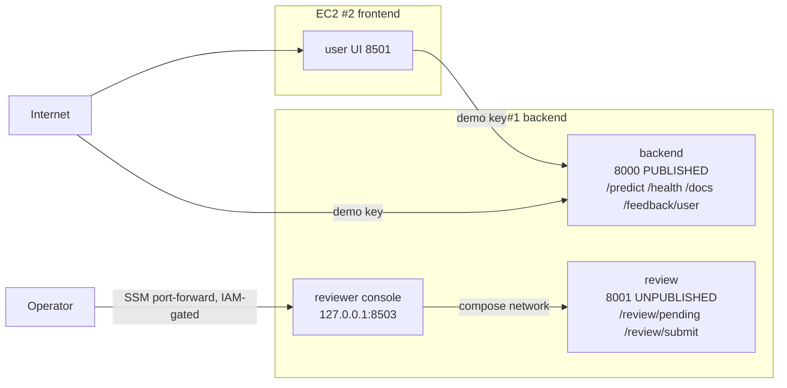

# Design Spec: Delete the Reviewer Shared Secret by Moving the Boundary

- Version: 2.0
- Owner: Rock Lambros
- Date: 2026-08-11
- Status: **REFUTED and not implemented.** Superseded by
  `2026-08-11-review-exposure-and-graded-panels-design.md`
- Scope as originally written: remove `REVIEWER_SHARED_SECRET` entirely, replacing it with a
  network boundary no credential is needed to cross

## 0. Why this was not built

An adversarial premortem on 2026-08-11 ran six independent perspectives against this document
at commit `721c7f4`. Every load-bearing claim below was then verified directly against the
live account rather than taken from the review. Four findings are independently fatal, and the
document is kept rather than deleted because the reasoning is the useful part.

**The move reverses premortem H16, which is the reason the three-tier split exists.**
`infra/terraform/iam.tf:165` grants the frontend tier "the demo API key and **NOTHING ELSE**";
the backend tier holds the W&B key, the read-only database secret, the demo key, the
fingerprint key and the RDS master secret. `infra/terraform/network.tf:278` gives the frontend
group no 5432 rule and says that is the point. The reviewer console renders attacker-chosen
text (`frontend/render.py`: "Inputs here are adversarial by definition"). Section 8 below asked
whether EC2 #1 had *memory* for the console and never asked what the console would gain access
to by being there. This is a bad trade on the merits, not a risk to be mitigated.

**The deploy is blocked three ways, and unblocking it requires weakening the control above.**
`infra/deploy/instance/roll.sh:186` writes `unresolved_image REVIEWER_IMAGE` on the backend
branch; `iam.tf:67` scopes the backend role to the backend ECR repository while the console
image is built into the frontend repository (`roll.sh:195`); `roll.sh:261` writes
`frontend.env`, which the console needs, only on the frontend branch. Section 7's "Terraform
runs after" ordering is therefore impossible: the IAM grant is a prerequisite of the move.

**Section 3.1's central factual claim is false.** The backend runs Docker Engine **25.0.16**,
verified over SSM. Docker began blocking direct-routed traffic to unpublished container ports
in Engine 28. The host reaches container addresses on the bridge regardless of publishing, so
"a stricter boundary than a `127.0.0.1` bind" is backwards — a loopback publish is reachable
only from host loopback, while an unpublished port is reachable from the bridge and from every
container on it. The argument for deleting the credential rested on a property this system
does not have.

**Rollback breaks inside the window this change would open.** `infra/terraform/data.tf:113`
sets `recovery_window_in_days = 7`, so deleting the secret on 2026-08-11 makes its name
unusable until 2026-08-18, which is the due date. Independently, `scripts/close_demo.sh:64`
rotates `reviewer-shared-secret` first under `set -e`, so deleting it aborts the closure script
before `demo-api-key` — the credential that did cross a cleartext listener — is ever rotated.

**And the premise was weaker than section 1 states.** The secret is not redundant.
`infra/deploy/compose.frontend.yml:38-43` confirms it is not present on the frontend host at
all, so it is the only control separating a compromised public-UI container from the reviewer
API. Section 1's first argument — that the secret "does not authenticate anybody" — conflates
*authenticating no one among several reviewers* with *authenticating no one*. It authenticates
the holder, which is the only distinction a single-principal system needs.

What survives is section 1's third argument alone: the reviewer routes answer the internet
because they share a listener with `/predict`. The successor spec closes exactly that, with a
peer guard on the existing app, and leaves the credential in place.

---

*Original document follows, unchanged.*

## 1. Why this exists

The reviewer console is guarded by a shared secret. Three questions were asked of that secret
on 2026-08-11, and it survived only one of them.

**It does not authenticate anybody.** There is one reviewer. `backend/reviewer_auth.py:61`
compares the token's claimed identity against the server's configured `REVIEWER_ID` and returns
the server's value regardless, so a validly signed token for any other identity authenticates
nobody. The secret distinguishes no reviewer from any other reviewer, because there is no other
reviewer.

**It does not protect the console.** Port 8503 has no ingress rule on any security group, and
`infra/deploy/compose.frontend.yml:49` binds it to `127.0.0.1` on the host besides. The operator
reaches it through an SSM port-forward. Nothing about that path needs a password.

**It protects the routes, because the routes are on the world-open port** — and this is the one
justification that holds. `/review/*` is served by the same FastAPI app as `/predict`
(`backend/app.py:180`), on 8000, which `var.demo_cidrs` opens to `0.0.0.0/0`. A security group
rule is per-port; an application is per-path. The port cannot tell the moderation queue from the
prediction endpoint.

A second listener alone would not fix this. The user-facing Streamlit on 8501 and the reviewer
console on 8503 are packed onto one instance carrying one security group
(`infra/deploy/compose.frontend.yml`), and `infra/terraform/network.tf:182` grants that entire
group access to the backend on 8000. The container exposed to the whole internet therefore sits
**inside** every network control that would otherwise wall off the reviewer API. Close 8000 to
the world and an SSRF or RCE in the public UI container still reads raw user comment text from
`/review/pending`.

The secret is a symptom of colocation. This spec removes the colocation, and the secret with it.

## 2. Starting position, verified

| Fact | Value | How verified |
|---|---|---|
| Backend instance | `t4g.medium`, 3835 MB total, **2670 MB available**, 24 GB free disk, 1 container | `aws ssm send-command`, 2026-08-11 |
| Frontend instance | `t4g.small`, runs both Streamlit containers | `aws ec2 describe-instances` |
| Reviewer console ingress | none, on any security group | `README.md:97`, `infra/terraform/network.tf:294` |
| Reviewer console host bind | `127.0.0.1:8503:8503` | `infra/deploy/compose.frontend.yml:49` |
| Deployed reviewer's backend address | `http://10.42.0.173:8000` (private) | `/toxic/endpoints/backend-internal` |
| Files referencing the secret or `/review/login` | 35, of which 4 are append-only historical plans | `grep -rl`, 2026-08-11 |
| Rollback path | previous SHA's images kept on disk one week | `infra/deploy/instance/roll.sh:323` |

Two consequences of the verified position are worth stating because they bound the risk.

The secret **never crosses the public listener on any path this project operates.** The console
posts it to a private VPC address; `scripts/seed_demo.py` only calls `/predict`. The live
exposure is that the route *accepts* the secret from the internet, making it online
brute-forceable — which is what the peer rate limiter at `backend/review_api.py:161` exists for.
That is a guessing surface, not an interception surface, and this spec should not be justified as
fixing an interception it was never subject to.

The reviewer console is **not graded.** The rubric's six core components are experiment tracking,
backend, data store, frontend, monitoring dashboard and CI/CD. "human-review workflow" appears
once, at `docs/week9_FinalProject.md:73`, in the topic-selection table describing the chosen
problem. No rubric line grades the console, it is in none of the five required screenshots, and
the instructor cannot reach it. This work is therefore correctness for its own sake, and must not
put a single graded surface at risk to get it.

## 3. The design

### 3.1 The boundary is an unpublished container port

A container port absent from a compose `ports:` block is bound to no host interface. It is
reachable only from containers on the same compose network. No security group, Elastic IP, or
host firewall reaches it, because there is nothing bound to reach. That is a stricter boundary
than a `127.0.0.1` bind, and unlike a password it cannot be guessed, leaked, replayed, or
forgotten in a rotation.

### 3.2 Three moves

**Split the router.** `/feedback/user` stays on the public 8000 app. It is called by the user UI
on EC2 #2, and it is the mechanism rubric 3.2 actually grades — "a mechanism to collect user
feedback to calculate live accuracy". It keeps the demo key, the rate limit and the body cap.
`/review/pending` and `/review/submit` move off. `/review/login` is deleted.

**Add `backend/review_app.py`.** A second FastAPI factory with a light lifespan: engine,
`session_factory`, `thresholds`. It does **not** load the model, so it does not pay the 400 MB
skops load or the 180-second start period that exists for it. It runs as a second container from
the same image with `command: uvicorn backend.review_app:app --host 0.0.0.0 --port 8001` and no
`ports:` block at all.

**Move the reviewer console to EC2 #1.** It continues to publish `127.0.0.1:8503:8503` for the
SSM tunnel and now calls `http://review:8001` over the compose network.

### 3.3 Identity, after

`reviewer_id` continues to come from `os.environ["REVIEWER_ID"]` inside the review app, so the
delivery spec's section 6.3 requirement — that reviewer identity is derived server-side and never
parsed from a client-held value — is unchanged. `SubmitRequest` keeps `extra="forbid"` and gains
no identity field. What changes is only that the server no longer demands a token to prove an
identity nothing else can reach the socket to assert.

The authentication does not weaken. It moves up a layer and gets stronger: opening the tunnel
requires IAM with `ssm:StartSession` scoped to one instance id — SSO-backed, short-lived,
CloudTrail-logged, revocable centrally. That check already ran before Streamlit rendered a pixel.
The static shared string behind it was the weaker of the two gates.

## 4. What changes

**Deleted outright:** `backend/reviewer_auth.py`; `tests/unit/test_reviewer_auth.py`; the
`/review/login` route; `BackendClient.login` in `frontend/api_client.py`; the sign-in screen in
`frontend/reviewer.py`; `REVIEWER_SHARED_SECRET` from Secrets Manager, `infra/terraform/`,
`infra/deploy/instance/roll.sh` and `infra/docker-compose.yml`; the `/review/login` entry in
`UNKEYED_PATHS` and the `AUTHENTICATED_READ_PATHS` frozenset in `backend/app.py`.

**Changed:** `backend/review_api.py` splits into a review router and a feedback router;
`infra/exposure.py` gains port 8001 as operator-only and records that 8503 now lives on EC2 #1;
`infra/deploy/compose.backend.yml` gains two services; `infra/deploy/compose.frontend.yml` loses
one; `infra/terraform/` drops the secret; `README.md`, `SECURITY.md`, `docs/tls-decision.md` and
`CONTRIBUTING.md` are updated, including the architecture diagrams and the port table at
`README.md:97`.

**The `reviewer` security group is deleted, not moved.** Its purpose was to give EC2 #2 the
egress the console needs while opening no ingress. EC2 #1 carries `aws_security_group.backend`,
whose egress is a strict superset — 443, DNS over UDP and TCP, NTP, plus 5432 to RDS — so once
the console lands there the group grants nothing that is not already granted. Keeping an
egress-only group attached to an instance that no longer runs the console would be a name
asserting a topology that had moved.

Deleting it does not weaken the H12 guarantee, because that guarantee was never expressed as a
named resource. `tests/unit/test_exposure_contract.py:92` sweeps **every ingress block in every
`.tf` file** for any port marked operator-only in `infra/exposure.py`. Registering 8001 there as
operator-only therefore extends that Terraform-wide sweep to the new boundary at no cost, and
any future rule exposing it fails CI. The registry's exact-equality check against `locals.ports`
(`test_exposure_contract.py:89`) means 8001 must be declared in both places or the suite goes
red — which is the intended coupling, not an obstacle.

**Not touched:** `docs/superpowers/plans/*` and `docs/cut-log.md` are append-only records of what
was planned and decided at the time. They are not rewritten to match a later design.

## 5. What does not change

`/predict`, `/health`, `/docs`, the user UI on 8501, the monitoring dashboard on 8502, the demo
key, every screenshot in `docs/submission-manifest.yml`, and all six graded components. The
graded surface is untouched by construction, and the deploy gate that proves it
(`infra/aws/verify_deploy.sh`) is unchanged.

## 6. Testing

The suite currently encodes the old topology in about ten files, and several would pass for the
wrong reason after the move rather than failing honestly. Each is named in the implementation
plan; two matter enough to state here.

`tests/integration/test_deployed_traversal.py:133` asserts the reviewer UI is unreachable by
probing the **frontend** host. After the move nothing listens on 8503 there, so it would pass
while proving nothing. It must be re-pointed at the backend host, and it should additionally
assert 8001 is unreachable from the internet on that host — the new boundary deserves the same
live proof the old one got.

`tests/unit/test_request_gate.py` asserts the gate's treatment of `/review/login` and
`/review/pending`. Those paths leave the public app, so the assertions become claims about routes
that no longer exist there. They are replaced by an assertion that the public app serves **no**
`/review/*` route at all, which is the property that actually replaces the secret.

New coverage: the review app refuses to start without `REVIEWER_ID`; the public app's route table
contains no `/review/` path; `compose.backend.yml`'s review service declares no `ports:` key.
That last one is the whole design expressed as a one-line test, and it is the test that fails if
somebody later "fixes" the review app by publishing its port.

## 7. Deploy and rollback

Backend first, so the console is never orphaned: EC2 #1 gains the review app and the console
while EC2 #2 still has its copy, then EC2 #2 drops it. Verification is the five existing probes,
plus a real SSM tunnel into the relocated console and one round trip through the queue, plus a
probe proving 8001 refuses connections from outside.

Terraform runs **after** both instances are serving the new topology, not before. The security
group deletion is the one step that cannot precede the move: detaching the `reviewer` group while
EC2 #2 still runs the console would cut the console's egress. Ordering the apply last also keeps
the infrastructure change out of the path that a container-level rollback has to undo.

Rollback is `make rollback`, which restores the previous SHA's images from disk. If the apply has
already run, rolling back the containers alone leaves EC2 #2 without the deleted group, so the
Terraform revert is a separate `git revert` plus apply. Both directions are rehearsed before the
apply, not after.

## 8. Risks

| Risk | Mitigation |
|---|---|
| Partial deploy leaves the console down | Sequence backend-first; console is not graded, so a gap is tolerable and visible |
| A relocated test passes for the wrong reason | Every moved assertion is re-pointed and re-verified against the live stack, not just re-run |
| Terraform apply against live infrastructure | Detaching and deleting an egress-only group changes no ingress and replaces no instance (`compute.tf:95`); plan reviewed before apply |
| Backend instance resource pressure | Verified 2670 MB available for roughly 350 MB of new containers; the review app loads no model |
| Scope creep into graded surfaces | Section 5 is the contract: if a change touches it, it is out of scope |

## 9. Out of scope

TLS remains unimplemented and remains an accepted risk recorded in `docs/tls-decision.md`; this
work removes a credential from the cleartext listener but does not encrypt it. Scheduling the
retention purge stays open. Multi-reviewer identity is not introduced — there is one reviewer,
and inventing a second would reintroduce exactly the authentication problem this spec deletes.
